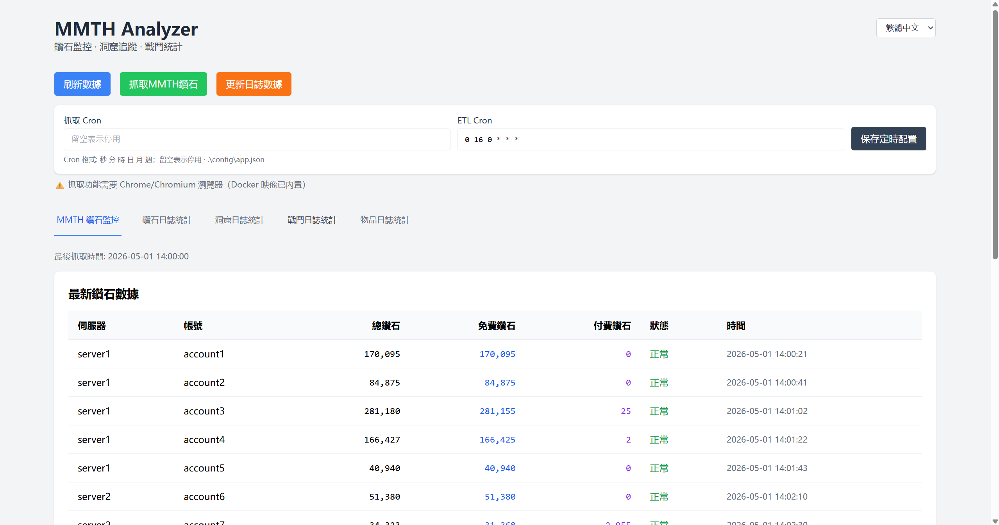
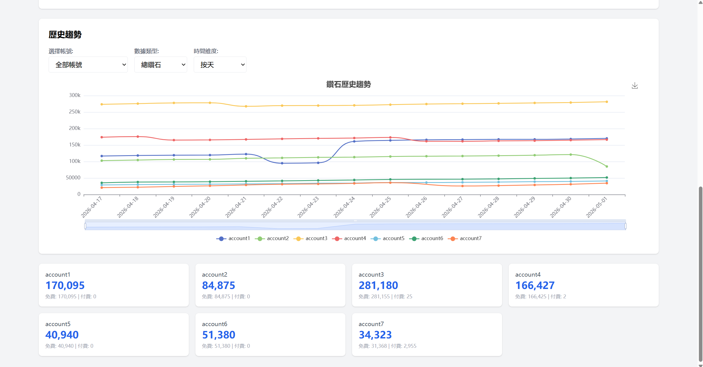
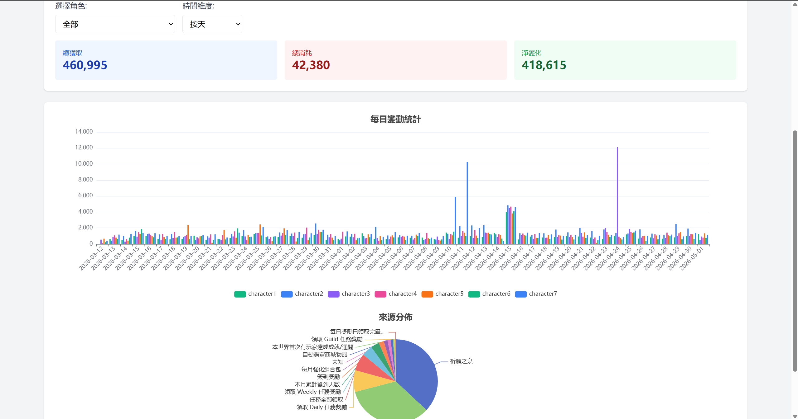
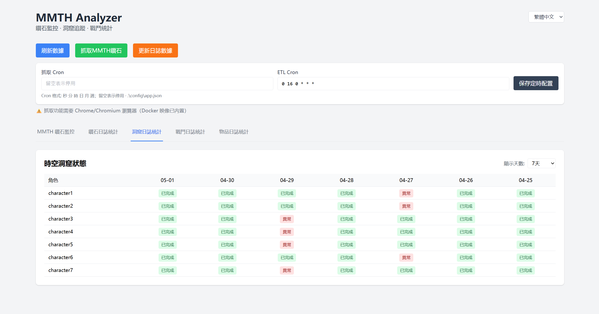
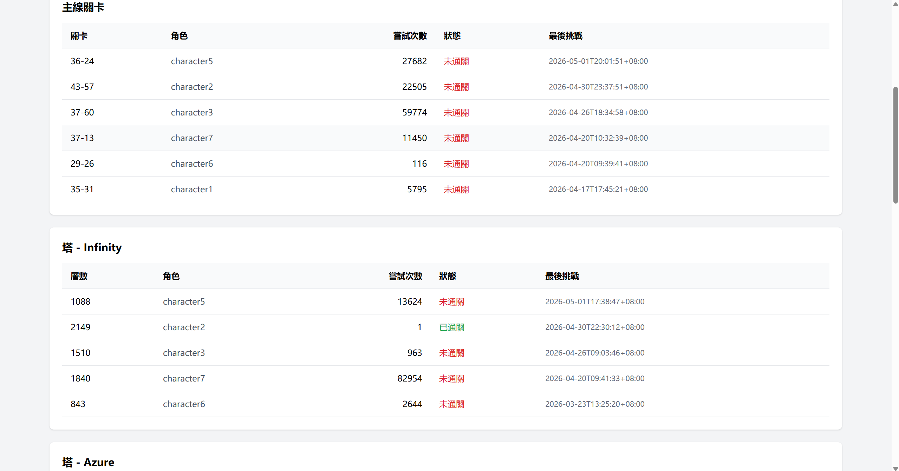
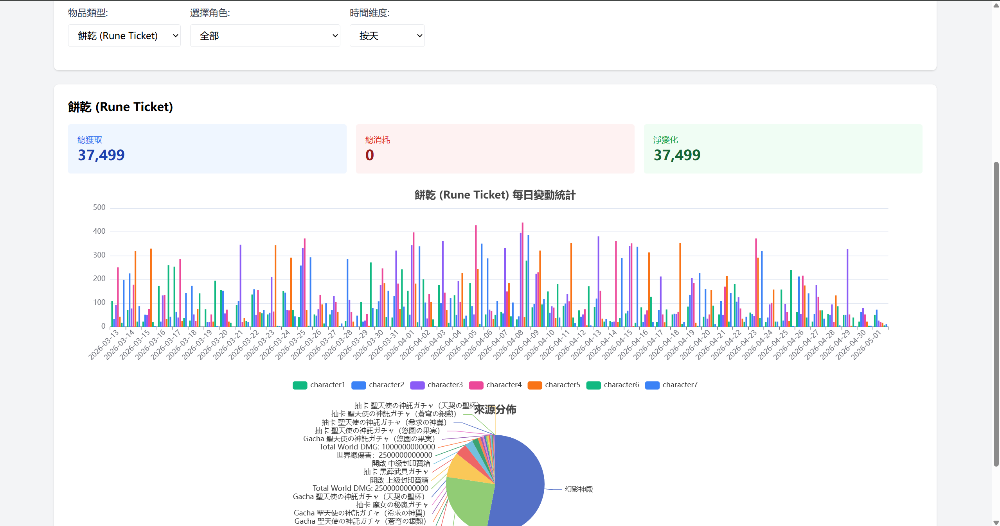

# MMTH Analyzer

[](https://github.com/hitazuki/mementomori-helper-analyzer/actions/workflows/docker.yml)
[](https://github.com/hitazuki/mementomori-helper-analyzer/releases)

MMTH Analyzer is a web dashboard and data processing service for [mementomori-helper](https://github.com/moonheart/mementomori-helper). It collects, processes, and visualizes diamond statistics, game logs, and related account activity.

## Features

- **Data dashboard**: Visualize statistics from `diamond_stats.json` and ETL output.
- **Scheduled scraping**: Periodically scrape account diamond balances from MMTH pages.
- **Charts and analysis**: Render daily changes and source distributions with ECharts.
- **Multi-account support**: Configure multiple MMTH servers and accounts for batch scraping.
- **ETL processing**: Integrates the `mmth-etl` submodule for log parsing and diamond statistics.
- **Multilingual log parsing**: ETL supports English, Traditional Chinese, Japanese, and Korean logs with dynamic language detection. See [SOURCE_MAPPING.md](mmth-etl/SOURCE_MAPPING.md).
- **Cave tracking**: Track Space-Time Cave task status, including completed, incomplete, failed, and not-run states.
- **Challenge statistics**: Analyze campaign and tower challenge records, attempts, completion status, and last challenge time.
- **Item statistics**: Track Rune Ticket and Upgrade Panacea gains and spending by source.

## Preview

| Preview 1 | Preview 2 |
|:---------:|:---------:|
|  |  |

| Preview 3 | Preview 4 |
|:---------:|:---------:|
|  |  |

| Preview 5 | Preview 6 |
|:---------:|:---------:|
|  |  |

## Quick Start

### Deployment Examples

- **Unified deployment**: [examples/unified/](examples/unified/) runs `mmth-analyzer` and `mementomori-webui` in one `docker-compose` stack.
- **Separated deployment**: [examples/separated/](examples/separated/) runs `mmth-analyzer` and `mementomori-webui` independently.

### Option 1: Docker Deployment

Two Docker image variants are available:

| Image tag | Size   | Purpose                          |
|-----------|--------|----------------------------------|
| `latest`  | ~420MB | Full image with scraping and ETL |
| `lite`    | ~25MB  | Lightweight ETL-only image       |

```bash
# Full image with scraping support
docker pull hitazuki/mmth-analyzer:latest

# Lightweight image for ETL-only usage
docker pull hitazuki/mmth-analyzer:lite

# Run the container
docker run -d \
  --name mmth-analyzer \
  -p 5391:5391 \
  -v ./data:/app/data \
  -v ./config:/app/config \
  hitazuki/mmth-analyzer:latest
```

Or use Docker Compose:

```bash
# Copy the example configuration
cp config/app.example.json config/app.json

# Edit config/app.json, then start the service
docker-compose up -d
```

Open <http://localhost:5391>.

### Option 2: Release Package

1. Open the [Releases](https://github.com/hitazuki/mementomori-helper-analyzer/releases) page.
2. Download the package for your platform:
   - Windows: `mmth-analyzer-vX.X.X-windows-amd64.zip`
   - Linux: `mmth-analyzer-vX.X.X-linux-amd64.tar.gz`
3. Extract the package.
4. Install Chrome or Chromium if you need scraping:
   - Windows: install [Google Chrome](https://www.google.com/chrome/).
   - Linux: install Chromium with your package manager, for example `sudo apt install chromium-browser` or `sudo dnf install chromium`.
5. Copy `config/app.example.json` to `config/app.json` and edit it.
6. Run the application:
   - Windows: `mmth-analyzer.exe`
   - Linux: `./mmth-analyzer`
7. Open <http://localhost:5391>.

> Scraping uses Chrome or Chromium to render MMTH pages. Chrome is included in the full Docker image, but release packages require a local browser installation. ETL-only usage does not require Chrome.

## Configuration

The default configuration file is `config/app.json`. You can also pass a custom path with `-config`.

```json
{
  "port": "5391",
  "data_dir": "./data",
  "cron_scrape": "0 0 2,14 * * *",
  "cron_etl": "0 0 1 * * *",
  "etl_binary_path": "./mmth-etl/mmth_etl.exe",
  "etl_output_dir": "./data/etl",
  "mmth_servers": [
    {
      "name": "server1",
      "base_url": "http://mmth-server:5390",
      "accounts": ["account1", "account2"],
      "log_path": "./data/logs/server1"
    }
  ]
}
```

| Key               | Description                                                      | Default                  |
|-------------------|------------------------------------------------------------------|--------------------------|
| `port`            | HTTP server port                                                 | `5391`                   |
| `data_dir`        | Data storage directory                                           | `./data`                 |
| `cron_scrape`     | Scrape schedule in six-field cron format                         | `0 0 2,14 * * *`         |
| `cron_etl`        | ETL schedule in six-field cron format                            | `0 0 1 * * *`            |
| `etl_binary_path` | Path to the ETL binary                                           | `./mmth-etl/mmth_etl.exe` |
| `etl_output_dir`  | ETL output directory                                             | `./data/etl`             |
| `mmth_servers`    | List of MMTH server configurations                               | -                        |
| `accounts`        | MMTH account names, matching the names shown in the MMTH selector | -                        |
| `log_path`        | Log file path or directory for ETL processing                     | -                        |

`cron_scrape` and `cron_etl` can be updated from the schedule configuration area in the web UI. After saving, the scheduler is updated immediately and the values are written back to the active configuration file. Leave a cron value empty to disable that scheduled task.

### Cron Examples

| Expression          | Meaning                      |
|---------------------|------------------------------|
| `0 0 2,14 * * *`    | Run every day at 02:00 and 14:00 |
| `0 0 1 * * *`       | Run every day at 01:00       |
| `*/30 * * * * *`    | Run every 30 seconds         |
| `0 */6 * * * *`     | Run every 6 hours            |

> `log_path` can point to a single log file, such as `./data/logs/server1.log`, or a directory, such as `./data/logs/server1`. When it points to a directory, all `.log` files in that directory are processed.

## Notes

- Scraping requires Chrome or Chromium. The full Docker image includes Chromium; release packages require a local installation.
- ETL does not require Chrome. It only needs access to configured log files.
- Scraping requires the configured MMTH server to be reachable from the analyzer service.

## Development

### Tech Stack

| Area     | Technology                  |
|----------|-----------------------------|
| Backend  | Go + Gin                    |
| Scraping | chromedp with headless Chrome |
| Frontend | Alpine.js + ECharts         |
| Styling  | Tailwind CSS                |
| ETL      | Go submodule in `mmth-etl/` |

### Build From Source

```bash
# Clone the repository with submodules
git clone --recursive https://github.com/hitazuki/mementomori-helper-analyzer.git
cd mementomori-helper-analyzer

# Build the ETL submodule
cd mmth-etl
go build -o mmth_etl .
cd ..

# Build the main application
go build -o mmth-analyzer ./cmd/server

# Run
./mmth-analyzer
```

On Windows:

```bash
go build -o mmth-analyzer.exe ./cmd/server
.\mmth-analyzer.exe
```

Run checks before submitting changes:

```bash
gofmt -l .
go vet ./...
go test ./...
```

## API

| Endpoint                                | Method | Description                         |
|-----------------------------------------|--------|-------------------------------------|
| `/api/health`                           | GET    | Health check                        |
| `/api/stats`                            | GET    | Get `diamond_stats.json` data       |
| `/api/mmth-diamonds/all`                | GET    | Get the latest scraped diamond data |
| `/api/mmth-diamonds/history`            | GET    | Get history for all accounts        |
| `/api/mmth-diamonds/history/:server/:account` | GET | Get history for one account         |
| `/api/scrape/all`                       | POST   | Trigger scraping for all accounts   |
| `/api/scrape/account`                   | POST   | Trigger scraping for one account    |
| `/api/etl/process`                      | POST   | Trigger ETL log processing          |
| `/api/etl/stats`                        | GET    | Get combined ETL statistics         |
| `/api/config/schedule`                  | GET    | Get current scrape and ETL cron schedules |
| `/api/config/schedule`                  | PUT    | Update and persist cron schedules   |
| `/api/cave/stats`                       | GET    | Get Space-Time Cave statistics      |
| `/api/challenge/stats`                  | GET    | Get challenge statistics            |
| `/api/rune-ticket/stats`                | GET    | Get Rune Ticket statistics          |
| `/api/upgrade-panacea/stats`            | GET    | Get Upgrade Panacea statistics      |
| `/api/sources`                          | GET    | Get source mapping data             |

## Project Structure

```text
mmth-analyzer/
+-- cmd/server/          # Server entry point
+-- internal/            # Internal Go packages
|   +-- config/          # Configuration loading and persistence
|   +-- handlers/        # HTTP handlers
|   +-- scheduler/       # Scheduled jobs
|   +-- scraper/         # MMTH scraping logic
|   +-- service/         # Business services
+-- mmth-etl/            # ETL submodule
+-- static/              # Frontend static assets
+-- config/              # Configuration files
+-- data/                # Runtime data directory
+-- examples/            # Deployment examples
+-- scripts/             # Utility scripts
```

## License

[LGPL-2.1](LICENSE)
